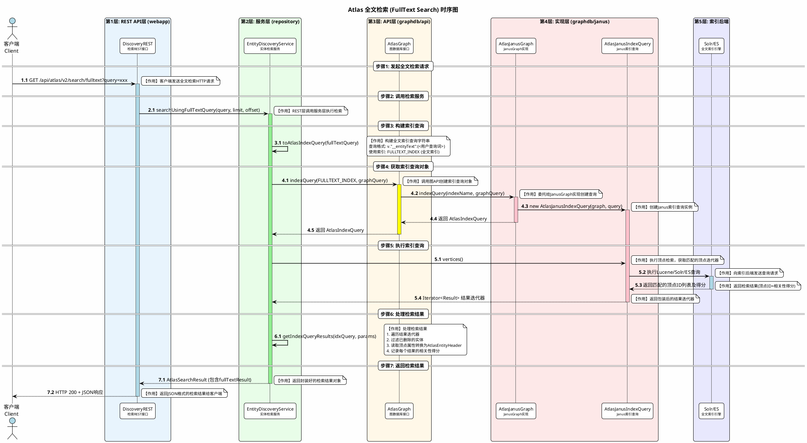
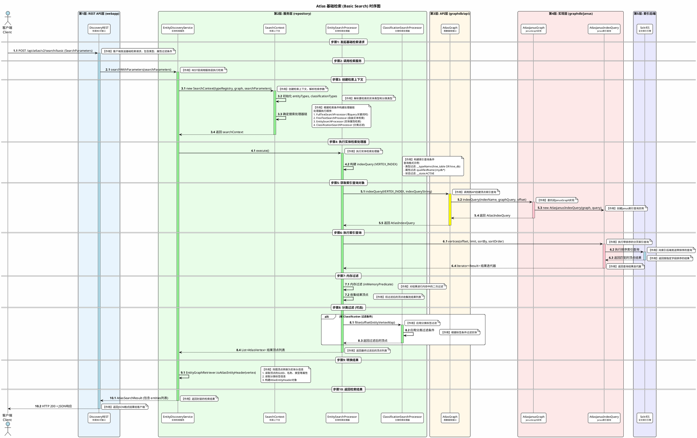
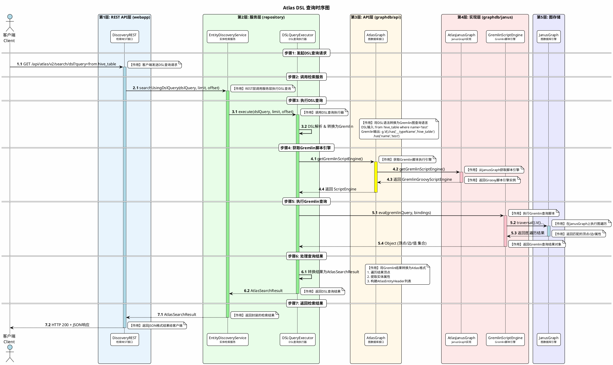
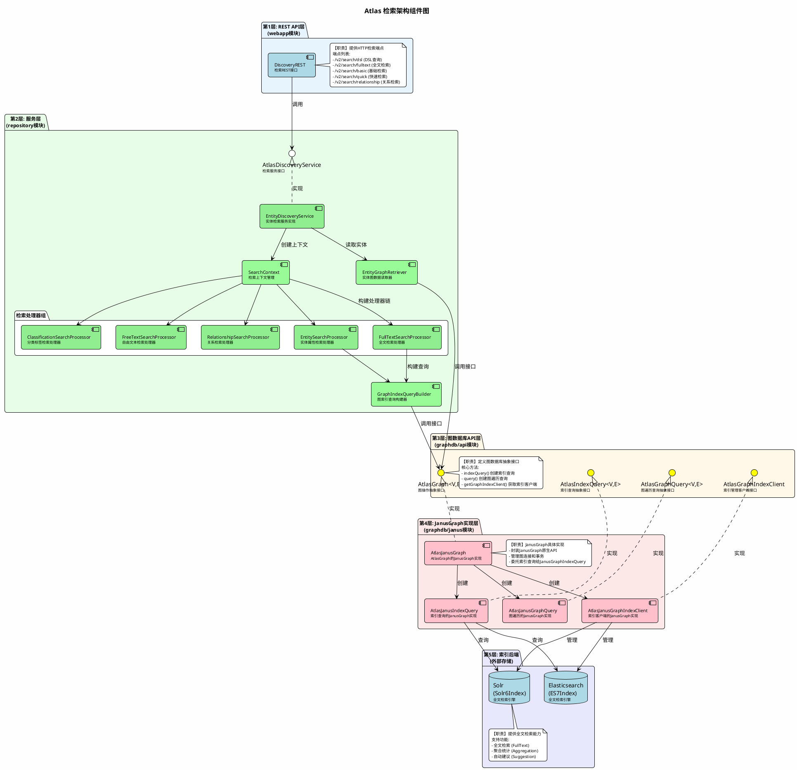

# Atlas 检索流程时序图及架构分析

## 一、概述

本文档详细说明 Apache Atlas 的检索流程，特别是请求如何经过 `repository`、`graphdb/api` 和 `graphdb/janus` 三层架构，以及如何替换 `graphdb/janus` 实现。

## 二、检索类型

Atlas 支持以下几种检索方式：

| 检索类型 | 描述 | 索引名 |
|---------|------|-------|
| **DSL 查询** | Domain Specific Language 查询 | VERTEX_INDEX |
| **全文检索 (FullText)** | 基于 Lucene 语法的全文搜索 | FULLTEXT_INDEX |
| **基础检索 (Basic)** | 基于实体属性的检索 | VERTEX_INDEX |
| **快速检索 (Quick)** | 简化的快速搜索 | VERTEX_INDEX + FULLTEXT_INDEX |
| **关系检索 (Relationship)** | 检索实体之间的关系 | EDGE_INDEX |

## 三、核心类说明

### 3.1 各层核心类职责

| 层级 | 类名 | 中文描述 | 核心职责 |
|------|------|---------|---------|
| **REST层** | `DiscoveryREST` | 检索REST接口 | 接收HTTP请求，参数校验，调用服务层 |
| **服务层** | `EntityDiscoveryService` | 实体检索服务 | 检索业务逻辑，结果组装，权限过滤 |
| **服务层** | `SearchContext` | 检索上下文 | 存储检索参数，管理处理器链 |
| **服务层** | `FullTextSearchProcessor` | 全文检索处理器 | 处理全文检索逻辑 |
| **服务层** | `EntitySearchProcessor` | 实体检索处理器 | 处理基于属性的实体检索 |
| **服务层** | `ClassificationSearchProcessor` | 分类检索处理器 | 处理标签/分类过滤 |
| **服务层** | `EntityGraphRetriever` | 实体图检索器 | 从图顶点读取实体属性 |
| **API层** | `AtlasGraph` | 图数据库接口 | 定义图操作和索引查询的抽象接口 |
| **API层** | `AtlasIndexQuery` | 索引查询接口 | 定义索引查询的抽象接口 |
| **实现层** | `AtlasJanusGraph` | JanusGraph实现 | AtlasGraph的JanusGraph具体实现 |
| **实现层** | `AtlasJanusIndexQuery` | Janus索引查询 | AtlasIndexQuery的JanusGraph实现 |
| **实现层** | `AtlasJanusGraphIndexClient` | Janus索引客户端 | 管理索引，提供聚合和建议词功能 |
| **后端** | `Solr6Index` | Solr索引 | Solr全文索引后端 |
| **后端** | `ElasticSearch7Index` | ES索引 | Elasticsearch全文索引后端 |

## 四、架构层次图

```plaintext
┌─────────────────────────────────────────────────────────────────────┐
│              第1层: REST API 层 (webapp 模块)                        │
│  ┌─────────────────────────────────────────────────────────────┐   │
│  │ DiscoveryREST - 检索REST接口，处理HTTP请求                    │   │
│  └─────────────────────────────────────────────────────────────┘   │
└─────────────────────────────────────────────────────────────────────┘
                                    │
                                    ▼
┌─────────────────────────────────────────────────────────────────────┐
│              第2层: 检索服务层 (repository 模块)                     │
│  ┌─────────────────────────────────────────────────────────────┐   │
│  │ EntityDiscoveryService - 检索业务逻辑实现                     │   │
│  │ SearchContext - 检索上下文，管理处理器链                       │   │
│  │ SearchProcessor - 各类检索处理器(全文/实体/分类)              │   │
│  └─────────────────────────────────────────────────────────────┘   │
└─────────────────────────────────────────────────────────────────────┘
                                    │
                                    ▼
┌─────────────────────────────────────────────────────────────────────┐
│              第3层: 图数据库API层 (graphdb/api 模块)                 │
│  ┌─────────────────────────────────────────────────────────────┐   │
│  │ AtlasGraph - 图操作抽象接口                                   │   │
│  │ AtlasIndexQuery - 索引查询抽象接口                            │   │
│  │ AtlasGraphQuery - 图遍历查询抽象接口                          │   │
│  └─────────────────────────────────────────────────────────────┘   │
└─────────────────────────────────────────────────────────────────────┘
                                    │
                                    ▼
┌─────────────────────────────────────────────────────────────────────┐
│              第4层: JanusGraph实现层 (graphdb/janus 模块)            │
│  ┌─────────────────────────────────────────────────────────────┐   │
│  │ AtlasJanusGraph - AtlasGraph的JanusGraph实现                 │   │
│  │ AtlasJanusIndexQuery - 索引查询的JanusGraph实现               │   │
│  │ AtlasJanusGraphIndexClient - 索引管理客户端                   │   │
│  └─────────────────────────────────────────────────────────────┘   │
└─────────────────────────────────────────────────────────────────────┘
                                    │
                                    ▼
┌─────────────────────────────────────────────────────────────────────┐
│              第5层: 索引后端 (外部存储)                              │
│  ┌──────────────────────┐    ┌──────────────────────┐              │
│  │ Solr (Solr6Index)    │    │ Elasticsearch (ES7)  │              │
│  │ 全文检索引擎          │    │ 全文检索引擎          │              │
│  └──────────────────────┘    └──────────────────────┘              │
└─────────────────────────────────────────────────────────────────────┘
```

## 五、PlantUML 时序图

### 5.1 全文检索 (FullText Search) 时序图



### 5.2 基础检索 (Basic Search) 时序图



### 5.3 DSL 查询时序图



### 5.4 完整检索架构组件图



## 六、关键类与接口说明

### 6.1 GraphDB API 层 (graphdb/api)

| 接口/类 | 说明 |
|--------|------|
| `AtlasGraph<V,E>` | 图数据库核心接口，定义图操作和索引查询方法 |
| `AtlasIndexQuery<V,E>` | 索引查询接口，支持顶点/边查询、分页、排序 |
| `AtlasGraphQuery<V,E>` | 图遍历查询接口 |
| `AtlasGraphIndexClient` | 索引管理客户端接口（聚合、建议词等） |
| `GraphIndexQueryParameters` | 索引查询参数封装类 |

### 6.2 GraphDB Janus 层 (graphdb/janus)

| 类 | 说明 |
|----|------|
| `AtlasJanusGraph` | `AtlasGraph` 的 JanusGraph 实现 |
| `AtlasJanusIndexQuery` | `AtlasIndexQuery` 的 JanusGraph 实现 |
| `AtlasJanusGraphQuery` | `AtlasGraphQuery` 的 JanusGraph 实现 |
| `AtlasJanusGraphIndexClient` | 索引客户端实现，支持 Solr/ES |
| `AtlasJanusGraphDatabase` | JanusGraph 数据库初始化和管理 |

### 6.3 索引类型

| 索引名 | 用途 | 配置 |
|-------|------|------|
| `VERTEX_INDEX` | 顶点属性索引，支持 Basic Search | `vertex_index` |
| `FULLTEXT_INDEX` | 全文索引，支持 FullText Search | `fulltext_index` |
| `EDGE_INDEX` | 边属性索引，支持 Relationship Search | `edge_index` |

## 七、替换 graphdb/janus 的影响分析

### 7.1 检索功能是否需要同步修改？

**答案：需要修改，但修改范围可控。**

由于 Atlas 采用了良好的分层架构设计，`graphdb/api` 定义了标准接口，`graphdb/janus` 只是其中一个实现。如果要替换 JanusGraph：

#### 7.1.1 需要实现的接口

```java
// 必须实现的核心接口
public class AtlasYourGraph implements AtlasGraph<YourVertex, YourEdge> {
    // 索引查询 - 检索核心
    AtlasIndexQuery<V, E> indexQuery(String indexName, String queryString);
    AtlasIndexQuery<V, E> indexQuery(String indexName, String queryString, int offset);
    AtlasIndexQuery<V, E> indexQuery(GraphIndexQueryParameters indexQueryParameters);
    
    // 图查询
    AtlasGraphQuery<V, E> query();
    
    // 索引客户端
    AtlasGraphIndexClient getGraphIndexClient();
    
    // Gremlin 支持
    GremlinGroovyScriptEngine getGremlinScriptEngine();
    Object executeGremlinScript(String query, boolean isPath);
}

// 索引查询实现
public class AtlasYourIndexQuery implements AtlasIndexQuery<YourVertex, YourEdge> {
    Iterator<Result<V, E>> vertices();
    Iterator<Result<V, E>> vertices(int offset, int limit);
    Iterator<Result<V, E>> vertices(int offset, int limit, String sortBy, Order sortOrder);
    Long vertexTotals();
    
    // 边查询
    Iterator<Result<V, E>> edges();
    Iterator<Result<V, E>> edges(int offset, int limit);
}

// 索引客户端实现
public class AtlasYourGraphIndexClient implements AtlasGraphIndexClient {
    // 聚合查询
    Map<String, List<AtlasAggregationEntry>> getAggregatedMetrics(AggregationContext ctx);
    
    // 建议词
    List<String> getSuggestions(String prefixString, String indexFieldName);
    
    // 搜索权重
    void applySearchWeight(String collectionName, Map<String, Integer> weights);
}
```

### 7.2 修改步骤

#### 步骤 1：创建新的 graphdb 模块

```plaintext
graphdb/
├── api/                          # 保持不变
├── janus/                        # JanusGraph 实现（可作为参考）
└── your-impl/                    # 新的图数据库实现
    ├── pom.xml
    └── src/main/java/org/apache/atlas/repository/graphdb/yourimpl/
        ├── AtlasYourGraph.java
        ├── AtlasYourGraphDatabase.java
        ├── AtlasYourIndexQuery.java
        ├── AtlasYourGraphQuery.java
        ├── AtlasYourGraphIndexClient.java
        ├── AtlasYourVertex.java
        ├── AtlasYourEdge.java
        └── GraphDbObjectFactory.java
```

#### 步骤 2：实现索引查询 (核心)

索引查询是检索功能的核心，需要特别注意：

```java
public class AtlasYourIndexQuery implements AtlasIndexQuery<AtlasYourVertex, AtlasYourEdge> {
    private final AtlasYourGraph graph;
    private final String indexName;
    private final String queryString;
    
    @Override
    public Iterator<Result<AtlasYourVertex, AtlasYourEdge>> vertices(int offset, int limit) {
        // 1. 将 queryString 转换为您的图数据库的查询格式
        // 2. 执行索引查询
        // 3. 将结果转换为 AtlasIndexQuery.Result
        
        // 示例：如果使用 Elasticsearch
        SearchRequest request = buildSearchRequest(indexName, queryString, offset, limit);
        SearchResponse response = esClient.search(request);
        
        return transformToResults(response.getHits());
    }
    
    @Override
    public Long vertexTotals() {
        // 返回总匹配数（用于分页）
        return executeCountQuery();
    }
}
```

#### 步骤 3：配置依赖注入

修改 `atlas-application.properties`：

```properties
# 图数据库实现配置
atlas.graph.storage.backend=your-backend
atlas.graph.index.search.backend=elasticsearch  # 或其他索引后端

# 类加载配置
atlas.graphdb.impl=org.apache.atlas.repository.graphdb.yourimpl.AtlasYourGraphDatabase
```

#### 步骤 4：确保索引兼容

Atlas 使用三种索引，您的实现需要支持：

| 索引 | 查询语法示例 |
|-----|-------------|
| VERTEX_INDEX | `v."__typeName":(hive_table) AND v."__state":(ACTIVE)` |
| FULLTEXT_INDEX | `v."__entityText":(search keywords)` |
| EDGE_INDEX | `e."__typeName":(relationship_type)` |

### 7.3 repository 层是否需要修改？

**答案：通常不需要修改。**

`repository` 层（包括 `EntityDiscoveryService`、`SearchProcessor` 等）只依赖 `graphdb/api` 接口，不直接依赖 `graphdb/janus`。只要新的实现正确实现了 API 接口，repository 层可以无缝使用。

```plaintext
┌─────────────────┐
│   repository    │  ──── 依赖 ────→  ┌──────────────┐
│ (不需要修改)     │                   │  graphdb/api │
└─────────────────┘                   └──────────────┘
                                              ↑
                                              │ 实现
                                    ┌─────────┴─────────┐
                                    │                   │
                              ┌─────────────┐    ┌─────────────┐
                              │graphdb/janus│    │graphdb/your │
                              │  (旧实现)    │    │  (新实现)    │
                              └─────────────┘    └─────────────┘
```

### 7.4 注意事项

1. **查询语法兼容性**：Atlas 使用类似 Lucene 的查询语法，新的图数据库需要能够解析或转换这种语法

2. **事务支持**：Atlas 使用 `@GraphTransaction` 注解管理事务，新实现需要支持

3. **索引管理**：需要实现 `AtlasGraphManagement` 接口来管理索引的创建和更新

4. **Gremlin 兼容**：DSL 查询依赖 Gremlin，如果新的图数据库不支持 Gremlin，需要修改 DSL 执行器

## 八、总结

| 组件 | 替换影响 | 修改复杂度 |
|------|---------|-----------|
| `graphdb/api` | 无需修改 | - |
| `repository` | 无需修改（如果 API 实现正确） | 低 |
| `graphdb/janus` → 新实现 | 需要完全重新实现 | 高 |
| 索引后端 | 可以复用或更换 | 中 |

Atlas 的分层设计使得替换底层图数据库成为可能，但需要完整实现 `graphdb/api` 中定义的所有接口，特别是与检索相关的 `AtlasIndexQuery` 和 `AtlasGraphIndexClient`。
