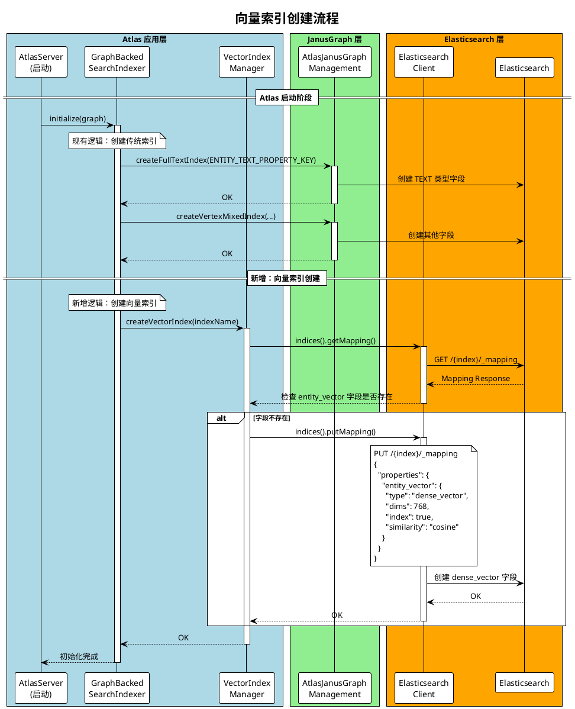
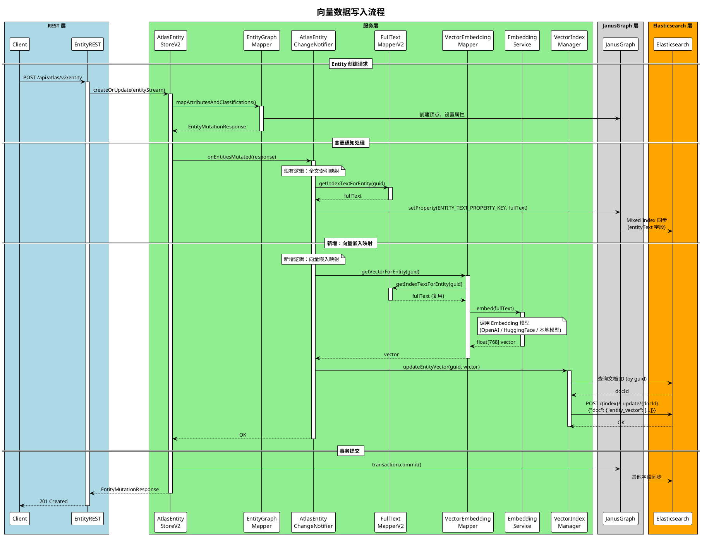
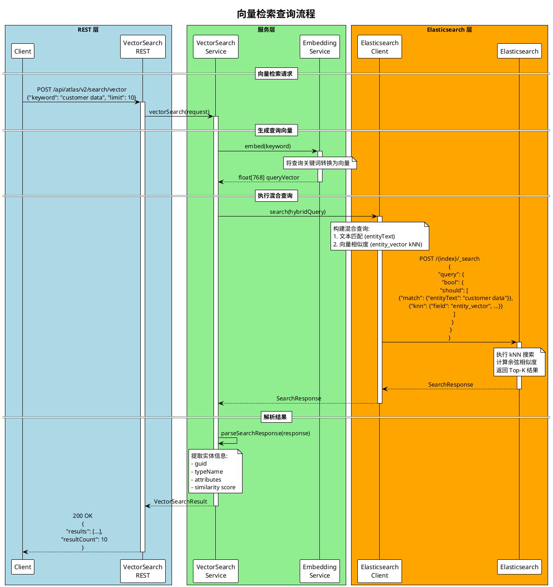
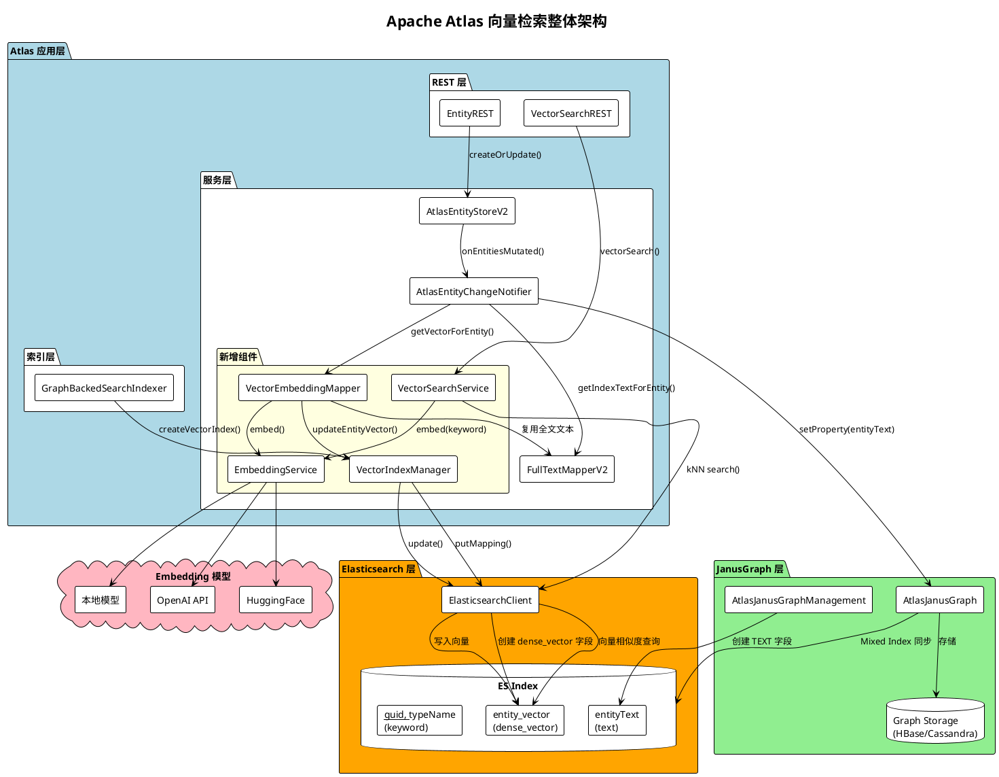
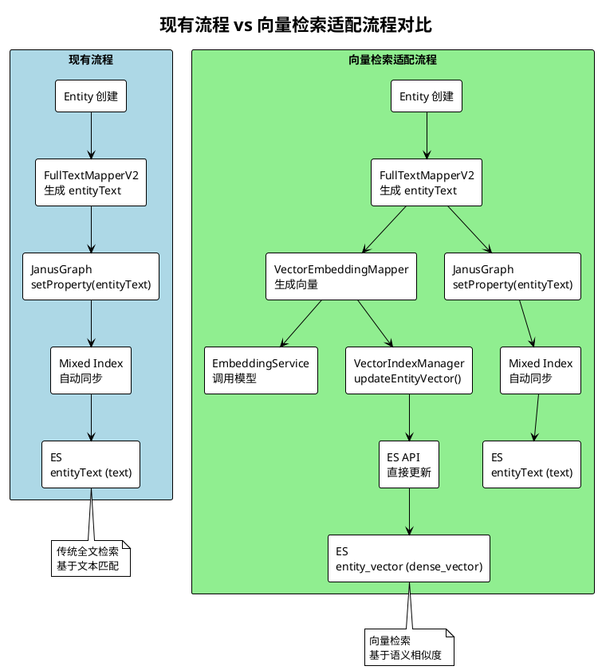

# Apache Atlas 支持 Elasticsearch 向量检索功能适配方案

## 目录
- [一、背景与目标](#一背景与目标)
- [二、现有架构分析](#二现有架构分析)
- [三、向量检索适配方案](#三向量检索适配方案)
- [四、索引创建阶段适配](#四索引创建阶段适配)
- [五、索引数据写入阶段适配](#五索引数据写入阶段适配)
- [六、向量检索查询阶段](#六向量检索查询阶段)
- [七、详细流程图（PlantUML）](#七详细流程图plantuml)
- [八、伪代码实现](#八伪代码实现)
- [九、配置与部署考虑](#九配置与部署考虑)

---

## 一、背景与目标

### 1.1 背景

Apache Atlas 当前使用 JanusGraph 作为图数据库，并通过 JanusGraph 的 Mixed Index 机制将数据同步到 Elasticsearch 进行全文检索。现有的全文检索基于 `entityText` 字段，使用传统的文本匹配方式。

随着 AI 和语义搜索的发展，Elasticsearch 8.x 已原生支持向量检索（kNN Search），可以实现基于语义相似度的搜索，提供更智能的元数据发现能力。

### 1.2 目标

在不破坏现有架构的前提下，扩展 Atlas 以支持：
1. **向量索引创建**：在 ES 中创建 `dense_vector` 类型的字段
2. **向量数据写入**：在实体创建/更新时，生成并写入向量嵌入
3. **向量检索查询**：支持基于语义相似度的 kNN 搜索

### 1.3 Elasticsearch 向量检索要求

| 要求 | 说明 |
|------|------|
| ES 版本 | 8.0+ (推荐 8.8+，支持更好的 kNN 性能) |
| 字段类型 | `dense_vector` |
| 向量维度 | 固定维度（如 768、1536 等，取决于 Embedding 模型）|
| 相似度算法 | `cosine`、`dot_product`、`l2_norm` |
| 索引类型 | HNSW (Hierarchical Navigable Small World) |

---

## 二、现有架构分析

### 2.1 现有索引创建流程

```
TypeDef 创建
    │
    ▼
GraphBackedSearchIndexer.onChange()
    │
    ▼
createFullTextIndex() / addMixedIndex()
    │
    ▼
AtlasJanusGraphManagement.addMixedIndex()
    │
    ▼
JanusGraph → ES (TEXT/STRING 类型字段)
```

### 2.2 现有数据写入流程

```
Entity 创建/更新
    │
    ▼
AtlasEntityChangeNotifier.onEntitiesMutated()
    │
    ▼
doFullTextMapping()
    │
    ▼
FullTextMapperV2.getIndexTextForEntity()
    │
    ▼
AtlasGraphUtilsV2.setEncodedProperty(vertex, ENTITY_TEXT_PROPERTY_KEY, fullText)
    │
    ▼
JanusGraph Transaction Commit
    │
    ▼
ES 文档更新 (entityText 字段)
```

### 2.3 关键扩展点

| 扩展点 | 现有组件 | 扩展方向 |
|--------|----------|----------|
| 索引字段创建 | `GraphBackedSearchIndexer` | 新增 `dense_vector` 字段创建 |
| 向量生成 | `FullTextMapperV2` | 新增 `VectorEmbeddingMapper` |
| 属性写入 | `AtlasEntityChangeNotifier` | 新增向量属性写入 |
| Graph API | `AtlasGraphManagement` | 新增向量索引 API |
| JanusGraph 实现 | `AtlasJanusGraphManagement` | 直接调用 ES API 创建向量字段 |

---

## 三、向量检索适配方案

### 3.1 整体架构

```
┌─────────────────────────────────────────────────────────────────────────────┐
│                              Atlas 应用层                                    │
│  ┌─────────────────────────────────────────────────────────────────────┐    │
│  │                        新增组件                                      │    │
│  │  ┌─────────────────┐  ┌─────────────────┐  ┌─────────────────────┐  │    │
│  │  │ EmbeddingService│  │VectorEmbedding  │  │VectorIndexManager   │  │    │
│  │  │ (向量生成服务)  │  │Mapper           │  │(向量索引管理)       │  │    │
│  │  └─────────────────┘  └─────────────────┘  └─────────────────────┘  │    │
│  └─────────────────────────────────────────────────────────────────────┘    │
│                                                                              │
│  ┌─────────────────────────────────────────────────────────────────────┐    │
│  │                        现有组件（扩展）                              │    │
│  │  ┌─────────────────┐  ┌─────────────────┐  ┌─────────────────────┐  │    │
│  │  │GraphBacked      │  │AtlasEntity      │  │FullTextMapperV2     │  │    │
│  │  │SearchIndexer    │  │ChangeNotifier   │  │(扩展向量映射)       │  │    │
│  │  └─────────────────┘  └─────────────────┘  └─────────────────────┘  │    │
│  └─────────────────────────────────────────────────────────────────────┘    │
└─────────────────────────────────────────────────────────────────────────────┘
                                    │
                                    ▼
┌─────────────────────────────────────────────────────────────────────────────┐
│                              JanusGraph 层                                   │
│  ┌─────────────────────────────────────────────────────────────────────┐    │
│  │  现有 Mixed Index 机制（TEXT/STRING 字段）                           │    │
│  └─────────────────────────────────────────────────────────────────────┘    │
│                                    +                                         │
│  ┌─────────────────────────────────────────────────────────────────────┐    │
│  │  新增：直接 ES API 调用（dense_vector 字段）                         │    │
│  │  原因：JanusGraph 不原生支持 dense_vector 类型                       │    │
│  └─────────────────────────────────────────────────────────────────────┘    │
└─────────────────────────────────────────────────────────────────────────────┘
                                    │
                                    ▼
┌─────────────────────────────────────────────────────────────────────────────┐
│                              Elasticsearch 层                                │
│  ┌─────────────────────────────────────────────────────────────────────┐    │
│  │  Index: janusgraph_vertex_index                                      │    │
│  │  ┌─────────────────────────────────────────────────────────────┐    │    │
│  │  │ 现有字段:                                                    │    │    │
│  │  │   - entityText (text)                                        │    │    │
│  │  │   - __typeName (keyword)                                     │    │    │
│  │  │   - __guid (keyword)                                         │    │    │
│  │  │   - ...                                                      │    │    │
│  │  ├─────────────────────────────────────────────────────────────┤    │    │
│  │  │ 新增字段:                                                    │    │    │
│  │  │   - entity_vector (dense_vector, dims=768)                   │    │    │
│  │  └─────────────────────────────────────────────────────────────┘    │    │
│  └─────────────────────────────────────────────────────────────────────┘    │
└─────────────────────────────────────────────────────────────────────────────┘
```

### 3.2 技术选型

| 组件 | 选型 | 说明 |
|------|------|------|
| Embedding 模型 | OpenAI / Hugging Face / 本地模型 | 可配置，支持多种模型 |
| 向量维度 | 768 (默认) | 可配置，取决于模型 |
| 相似度算法 | cosine | 适合文本语义相似度 |
| ES 客户端 | Elasticsearch Java API Client 8.x | 直接调用 ES API |

---

## 四、索引创建阶段适配

### 4.1 问题分析

JanusGraph 的 Mixed Index 机制不支持 Elasticsearch 的 `dense_vector` 类型，因此需要：
1. **绕过 JanusGraph**：直接调用 ES API 创建向量字段
2. **时机选择**：在 Atlas 启动时或首次使用向量功能时创建

### 4.2 适配方案

#### 方案 A：Atlas 启动时创建（推荐）

在 `GraphBackedSearchIndexer.initialize()` 中增加向量索引创建逻辑：

```
Atlas 启动
    │
    ▼
GraphBackedSearchIndexer.initialize()
    │
    ├── 现有逻辑：createFullTextIndex(ENTITY_TEXT_PROPERTY_KEY)
    │
    └── 新增逻辑：VectorIndexManager.createVectorIndex()
            │
            ▼
        ElasticsearchClient.indices().putMapping()
            │
            ▼
        ES 索引新增 entity_vector (dense_vector) 字段
```

#### 方案 B：延迟创建（按需）

在首次写入向量数据时检查并创建索引字段。

### 4.3 ES Mapping 定义

```json
{
  "properties": {
    "entity_vector": {
      "type": "dense_vector",
      "dims": 768,
      "index": true,
      "similarity": "cosine",
      "index_options": {
        "type": "hnsw",
        "m": 16,
        "ef_construction": 100
      }
    }
  }
}
```

### 4.4 伪代码：向量索引创建

```java
// VectorIndexManager.java
public class VectorIndexManager {
    
    private final ElasticsearchClient esClient;
    private final int vectorDimension;
    
    public void createVectorIndex(String indexName) {
        // 检查索引是否存在
        if (!vectorFieldExists(indexName, ENTITY_VECTOR_PROPERTY_KEY)) {
            // 创建 dense_vector 字段映射
            PutMappingRequest request = PutMappingRequest.of(r -> r
                .index(indexName)
                .properties(ENTITY_VECTOR_PROPERTY_KEY, p -> p
                    .denseVector(dv -> dv
                        .dims(vectorDimension)
                        .index(true)
                        .similarity("cosine")
                        .indexOptions(io -> io
                            .type("hnsw")
                            .m(16)
                            .efConstruction(100)
                        )
                    )
                )
            );
            
            esClient.indices().putMapping(request);
            LOG.info("Created vector index field: {}", ENTITY_VECTOR_PROPERTY_KEY);
        }
    }
    
    private boolean vectorFieldExists(String indexName, String fieldName) {
        GetMappingResponse response = esClient.indices().getMapping(
            GetMappingRequest.of(r -> r.index(indexName))
        );
        // 检查字段是否存在
        return response.result().get(indexName)
            .mappings().properties().containsKey(fieldName);
    }
}
```

---

## 五、索引数据写入阶段适配

### 5.1 问题分析

现有流程通过 JanusGraph 的 Mixed Index 机制自动同步数据到 ES，但：
1. JanusGraph 不支持 `dense_vector` 类型的属性
2. 需要在实体变更时生成向量嵌入并写入 ES

### 5.2 适配方案

#### 方案 A：扩展 AtlasEntityChangeNotifier（推荐）

在现有的 `doFullTextMapping()` 之后，增加向量嵌入生成和写入逻辑：

```
Entity 创建/更新
    │
    ▼
AtlasEntityStoreV2.createOrUpdate()
    │
    ▼
entityChangeNotifier.onEntitiesMutated()
    │
    ├── 现有逻辑：doFullTextMapping()
    │       │
    │       └── 写入 entityText 到 Graph 顶点
    │               │
    │               └── JanusGraph Mixed Index → ES
    │
    └── 新增逻辑：doVectorEmbeddingMapping()
            │
            ├── VectorEmbeddingMapper.getVectorForEntity(guid)
            │       │
            │       ├── 获取实体全文文本 (复用 FullTextMapperV2)
            │       │
            │       └── EmbeddingService.embed(fullText)
            │               │
            │               └── 调用 Embedding 模型生成向量
            │
            └── VectorIndexManager.updateEntityVector(guid, vector)
                    │
                    └── ElasticsearchClient.update()
                            │
                            └── 直接更新 ES 文档的 entity_vector 字段
```

#### 方案 B：异步处理

使用消息队列异步生成向量，避免影响主流程性能。

### 5.3 伪代码：向量数据写入

```java
// AtlasEntityChangeNotifier.java (扩展)
public class AtlasEntityChangeNotifier {
    
    @Inject
    private VectorEmbeddingMapper vectorEmbeddingMapper;
    
    @Inject
    private VectorIndexManager vectorIndexManager;
    
    @Override
    public void onEntitiesMutated(EntityMutationResponse response, boolean isImport) {
        // 现有逻辑
        doFullTextMapping(response.getCreatedEntities());
        doFullTextMapping(response.getUpdatedEntities());
        
        // 新增：向量嵌入映射
        if (isVectorSearchEnabled()) {
            doVectorEmbeddingMapping(response.getCreatedEntities());
            doVectorEmbeddingMapping(response.getUpdatedEntities());
        }
        
        // 现有逻辑
        notifyListeners(...);
    }
    
    private void doVectorEmbeddingMapping(List<AtlasEntityHeader> entityHeaders) {
        if (CollectionUtils.isEmpty(entityHeaders)) {
            return;
        }
        
        for (AtlasEntityHeader entityHeader : entityHeaders) {
            String guid = entityHeader.getGuid();
            
            try {
                // 生成向量嵌入
                float[] vector = vectorEmbeddingMapper.getVectorForEntity(guid);
                
                // 写入 ES
                vectorIndexManager.updateEntityVector(guid, vector);
                
            } catch (Exception e) {
                LOG.error("Vector embedding failed for entity: {}", guid, e);
            }
        }
    }
}

// VectorEmbeddingMapper.java
public class VectorEmbeddingMapper {
    
    @Inject
    private FullTextMapperV2 fullTextMapper;
    
    @Inject
    private EmbeddingService embeddingService;
    
    public float[] getVectorForEntity(String guid) throws AtlasBaseException {
        // 复用现有的全文文本生成逻辑
        String fullText = fullTextMapper.getIndexTextForEntity(guid);
        
        if (StringUtils.isEmpty(fullText)) {
            return new float[embeddingService.getEmbeddingDimension()];
        }
        
        // 调用 Embedding 服务生成向量
        return embeddingService.embed(fullText);
    }
}

// VectorIndexManager.java
public class VectorIndexManager {
    
    @Inject
    private ElasticsearchClient esClient;
    
    public void updateEntityVector(String guid, float[] vector) {
        // 构建 ES 文档 ID（与 JanusGraph 顶点 ID 对应）
        String docId = getDocumentIdByGuid(guid);
        
        // 更新 ES 文档
        UpdateRequest<Map, Map> request = UpdateRequest.of(u -> u
            .index(getIndexName())
            .id(docId)
            .doc(Map.of(ENTITY_VECTOR_PROPERTY_KEY, vector))
        );
        
        esClient.update(request, Map.class);
    }
    
    private String getDocumentIdByGuid(String guid) {
        // 通过 GUID 查询 ES 获取文档 ID
        SearchResponse<Map> response = esClient.search(s -> s
            .index(getIndexName())
            .query(q -> q.term(t -> t.field("__guid").value(guid)))
            .size(1),
            Map.class
        );
        
        if (response.hits().hits().isEmpty()) {
            throw new RuntimeException("Document not found for guid: " + guid);
        }
        
        return response.hits().hits().get(0).id();
    }
}
```

### 5.4 Embedding 服务接口

```java
// EmbeddingService.java
public interface EmbeddingService {
    
    /**
     * 将文本转换为向量嵌入
     */
    float[] embed(String text);
    
    /**
     * 批量转换
     */
    List<float[]> embedBatch(List<String> texts);
    
    /**
     * 获取向量维度
     */
    int getEmbeddingDimension();
}

// OpenAIEmbeddingService.java (示例实现)
public class OpenAIEmbeddingService implements EmbeddingService {
    
    private static final String MODEL = "text-embedding-ada-002";
    private static final int DIMENSION = 1536;
    
    @Override
    public float[] embed(String text) {
        // 调用 OpenAI Embedding API
        EmbeddingRequest request = EmbeddingRequest.builder()
            .model(MODEL)
            .input(text)
            .build();
        
        EmbeddingResponse response = openAiClient.createEmbedding(request);
        
        return toFloatArray(response.getData().get(0).getEmbedding());
    }
    
    @Override
    public int getEmbeddingDimension() {
        return DIMENSION;
    }
}

// LocalEmbeddingService.java (本地模型示例)
public class LocalEmbeddingService implements EmbeddingService {
    
    private static final int DIMENSION = 768;
    private final SentenceTransformer model;
    
    public LocalEmbeddingService() {
        // 加载本地 Sentence Transformer 模型
        this.model = new SentenceTransformer("all-MiniLM-L6-v2");
    }
    
    @Override
    public float[] embed(String text) {
        return model.encode(text);
    }
    
    @Override
    public int getEmbeddingDimension() {
        return DIMENSION;
    }
}
```

---

## 六、向量检索查询阶段

### 6.1 查询流程

```
用户查询请求
    │
    ▼
VectorSearchREST.vectorSearch(keyword)
    │
    ▼
VectorSearchService.vectorSearch(request)
    │
    ├── EmbeddingService.embed(keyword)
    │       │
    │       └── 将查询关键词转换为向量
    │
    └── ElasticsearchClient.search(knnQuery)
            │
            └── ES kNN 查询
                    │
                    └── 返回相似度最高的实体
```

### 6.2 混合查询（推荐）

结合传统文本搜索和向量搜索，提供更好的搜索效果：

```java
// 混合查询：文本匹配 + 向量相似度
SearchRequest request = SearchRequest.of(s -> s
    .index(indexName)
    .query(q -> q
        .bool(b -> b
            // 文本匹配（模糊搜索）
            .should(sh -> sh
                .match(m -> m
                    .field("entityText")
                    .query(keyword)
                    .fuzziness("AUTO")
                )
            )
            // 向量相似度（kNN）
            .should(sh -> sh
                .knn(k -> k
                    .field("entity_vector")
                    .queryVector(queryVector)
                    .numCandidates(100)
                    .k(10)
                )
            )
        )
    )
);
```

---

## 七、详细流程图（PlantUML）

### 7.1 向量索引创建流程



### 7.2 向量数据写入流程



### 7.3 向量检索查询流程



### 7.4 整体架构图



### 7.5 数据流对比图



---

## 八、伪代码实现

### 8.1 配置类

```java
// VectorSearchConfiguration.java
@Configuration
public class VectorSearchConfiguration {
    
    @Value("${atlas.vector.search.enabled:false}")
    private boolean vectorSearchEnabled;
    
    @Value("${atlas.vector.embedding.dimension:768}")
    private int embeddingDimension;
    
    @Value("${atlas.vector.embedding.service:local}")
    private String embeddingServiceType;
    
    @Value("${atlas.vector.embedding.model:all-MiniLM-L6-v2}")
    private String embeddingModel;
    
    @Value("${atlas.vector.index.similarity:cosine}")
    private String similarityFunction;
    
    @Bean
    public EmbeddingService embeddingService() {
        switch (embeddingServiceType) {
            case "openai":
                return new OpenAIEmbeddingService(openAiApiKey, embeddingModel);
            case "huggingface":
                return new HuggingFaceEmbeddingService(embeddingModel);
            default:
                return new LocalEmbeddingService(embeddingModel);
        }
    }
}
```

### 8.2 常量定义

```java
// Constants.java (扩展)
public final class Constants {
    // 现有常量...
    
    // 新增：向量检索相关常量
    public static final String ENTITY_VECTOR_PROPERTY_KEY = "entity_vector";
    public static final int DEFAULT_VECTOR_DIMENSION = 768;
    public static final String VECTOR_SIMILARITY_COSINE = "cosine";
}
```

### 8.3 GraphBackedSearchIndexer 扩展

```java
// GraphBackedSearchIndexer.java (扩展)
@Component
public class GraphBackedSearchIndexer implements SearchIndexer {
    
    @Inject
    private VectorIndexManager vectorIndexManager;
    
    @Inject
    private VectorSearchConfiguration vectorConfig;
    
    private void initialize(AtlasGraph graph) throws RepositoryException, IndexException {
        // 现有初始化逻辑...
        createFullTextIndex(management, ENTITY_TEXT_PROPERTY_KEY, String.class, SINGLE);
        
        // 新增：创建向量索引
        if (vectorConfig.isVectorSearchEnabled()) {
            initializeVectorIndex();
        }
        
        commit(management);
    }
    
    private void initializeVectorIndex() {
        try {
            String indexName = getVertexIndexName();
            vectorIndexManager.createVectorIndex(indexName);
            LOG.info("Vector index initialized successfully");
        } catch (Exception e) {
            LOG.error("Failed to initialize vector index", e);
        }
    }
}
```

### 8.4 AtlasEntityChangeNotifier 扩展

```java
// AtlasEntityChangeNotifier.java (扩展)
@Component
public class AtlasEntityChangeNotifier implements IAtlasEntityChangeNotifier {
    
    @Inject
    private VectorEmbeddingMapper vectorEmbeddingMapper;
    
    @Inject
    private VectorIndexManager vectorIndexManager;
    
    @Inject
    private VectorSearchConfiguration vectorConfig;
    
    @Override
    public void onEntitiesMutated(EntityMutationResponse response, boolean isImport) {
        // 现有逻辑
        doFullTextMapping(response.getCreatedEntities());
        doFullTextMapping(response.getUpdatedEntities());
        doFullTextMapping(response.getPartialUpdatedEntities());
        
        // 新增：向量嵌入映射
        if (vectorConfig.isVectorSearchEnabled()) {
            doVectorEmbeddingMapping(response.getCreatedEntities());
            doVectorEmbeddingMapping(response.getUpdatedEntities());
            doVectorEmbeddingMapping(response.getPartialUpdatedEntities());
        }
        
        // 现有逻辑
        notifyListeners(...);
    }
    
    private void doVectorEmbeddingMapping(List<AtlasEntityHeader> entityHeaders) {
        if (CollectionUtils.isEmpty(entityHeaders)) {
            return;
        }
        
        MetricRecorder metric = RequestContext.get().startMetricRecord("vectorEmbeddingMapping");
        
        for (AtlasEntityHeader entityHeader : entityHeaders) {
            if (GraphHelper.isInternalType(entityHeader.getTypeName())) {
                continue;
            }
            
            String guid = entityHeader.getGuid();
            
            try {
                // 生成向量嵌入
                float[] vector = vectorEmbeddingMapper.getVectorForEntity(guid);
                
                // 写入 ES
                vectorIndexManager.updateEntityVector(guid, vector);
                
                LOG.debug("Vector embedding updated for entity: {}", guid);
            } catch (Exception e) {
                LOG.error("Vector embedding failed for entity: {}", guid, e);
            }
        }
        
        RequestContext.get().endMetricRecord(metric);
    }
}
```

---

## 九、配置与部署考虑

### 9.1 配置参数

```properties
# atlas-application.properties

# 向量检索开关
atlas.vector.search.enabled=true

# Embedding 服务配置
atlas.vector.embedding.service=local
atlas.vector.embedding.model=all-MiniLM-L6-v2
atlas.vector.embedding.dimension=768

# OpenAI 配置（如果使用 OpenAI）
atlas.vector.embedding.openai.api-key=${OPENAI_API_KEY}
atlas.vector.embedding.openai.model=text-embedding-ada-002

# 向量索引配置
atlas.vector.index.similarity=cosine
atlas.vector.index.hnsw.m=16
atlas.vector.index.hnsw.ef-construction=100

# 异步处理配置（可选）
atlas.vector.embedding.async.enabled=false
atlas.vector.embedding.async.queue-size=1000
atlas.vector.embedding.async.thread-pool-size=4
```

### 9.2 Elasticsearch 版本要求

| 功能 | 最低版本 | 推荐版本 |
|------|----------|----------|
| dense_vector 字段 | 7.0+ | 8.0+ |
| kNN 搜索 | 8.0+ | 8.8+ |
| HNSW 索引 | 8.0+ | 8.8+ |
| 混合查询优化 | 8.8+ | 8.11+ |

### 9.3 性能考虑

| 考虑点 | 建议 |
|--------|------|
| Embedding 延迟 | 使用本地模型或批量处理减少 API 调用 |
| 向量维度 | 768 维平衡了效果和性能 |
| 索引大小 | dense_vector 会增加索引大小，需要更多存储 |
| 查询性能 | 使用 HNSW 索引，调整 m 和 ef_construction 参数 |
| 异步处理 | 对于大量实体更新，考虑异步生成向量 |

### 9.4 迁移策略

1. **增量迁移**：新创建的实体自动生成向量
2. **批量回填**：通过后台任务为现有实体生成向量
3. **双写模式**：同时支持传统搜索和向量搜索

---

## 十、总结

### 10.1 适配要点

| 阶段 | 适配内容 | 实现方式 |
|------|----------|----------|
| **索引创建** | 创建 dense_vector 字段 | 直接调用 ES API (绕过 JanusGraph) |
| **数据写入** | 生成并写入向量嵌入 | 扩展 AtlasEntityChangeNotifier |
| **向量检索** | kNN 查询 | 使用 ES 8.x kNN API |

### 10.2 关键扩展点

1. **VectorIndexManager**：管理向量索引的创建和更新
2. **VectorEmbeddingMapper**：生成实体的向量嵌入
3. **EmbeddingService**：抽象的向量生成服务接口
4. **VectorSearchService**：向量检索服务（已存在）

### 10.3 与现有架构的兼容性

- **不破坏现有流程**：向量功能作为可选扩展
- **复用现有组件**：复用 FullTextMapperV2 生成的文本
- **独立的 ES 操作**：向量字段通过直接 ES API 管理，不影响 JanusGraph Mixed Index
