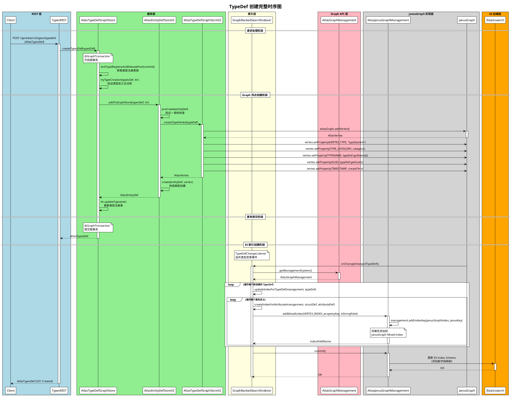
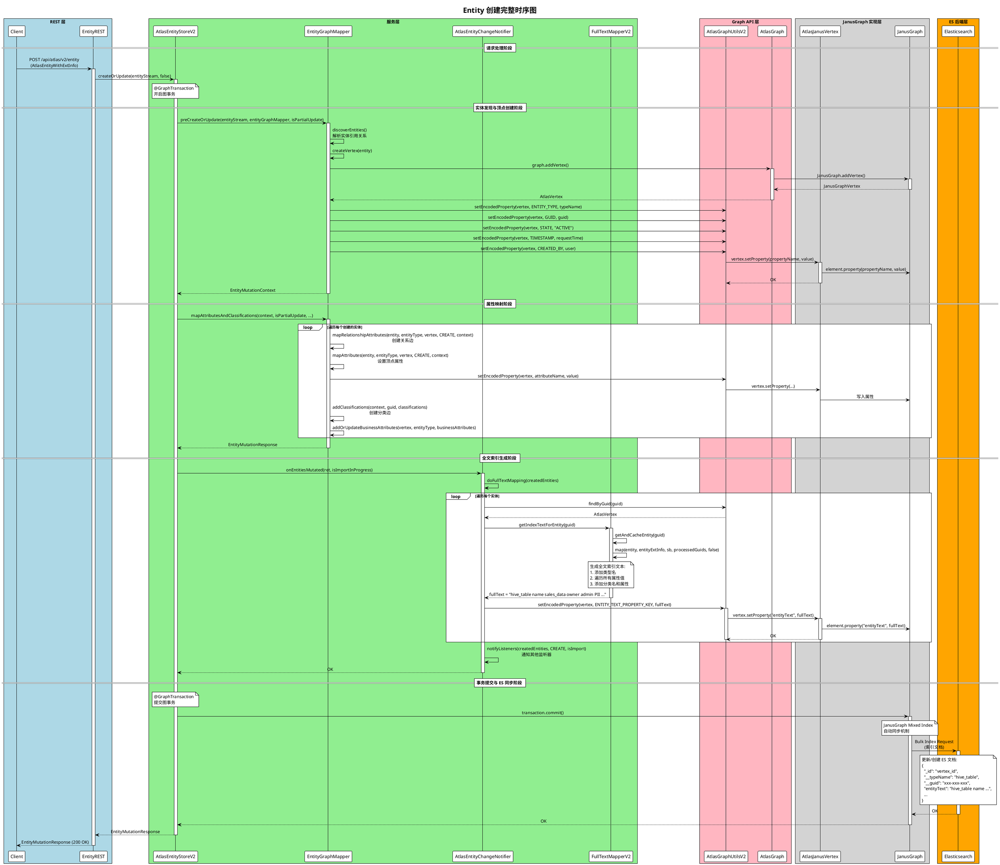
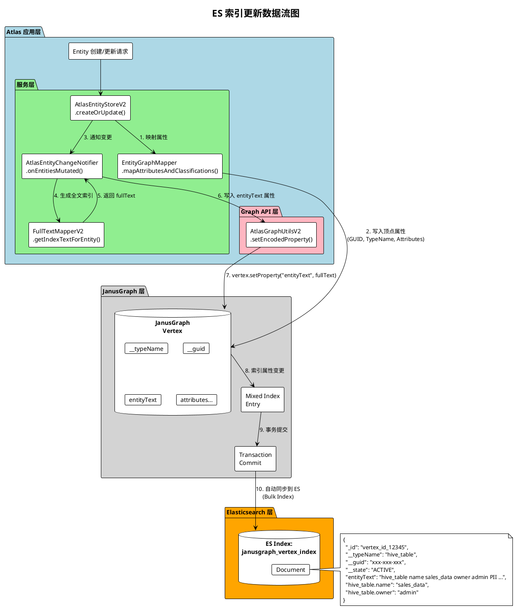
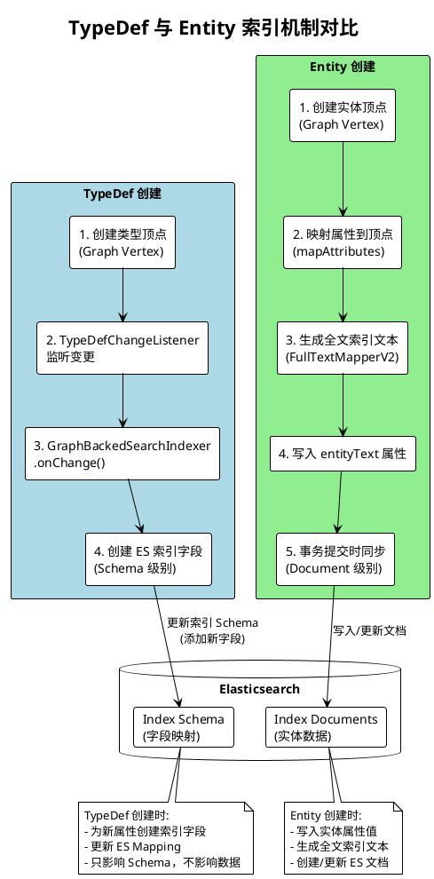
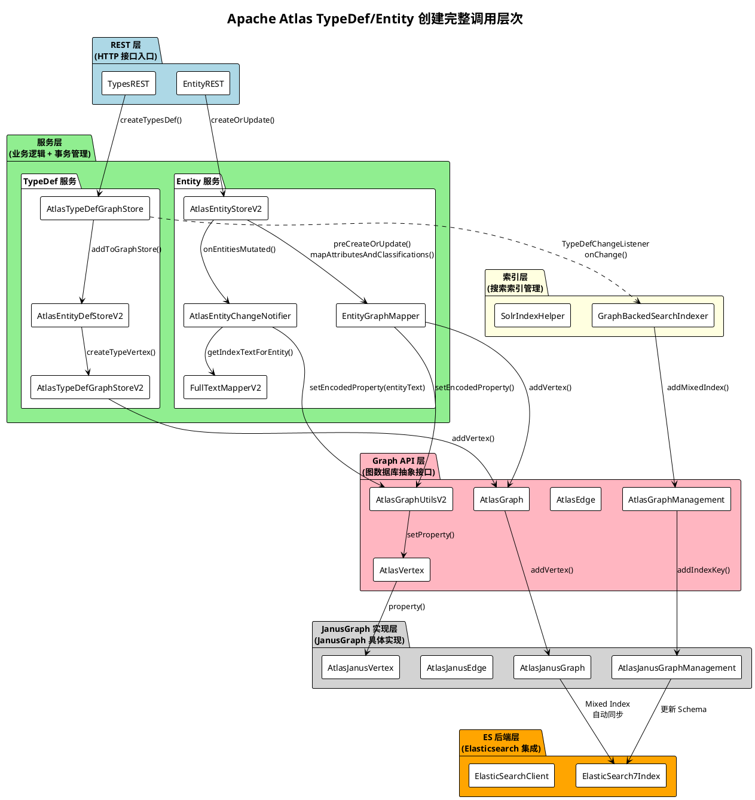

# Apache Atlas TypeDef 与 Entity 创建及 ES 索引完整流程分析

## 目录
- [一、整体架构与代码层次](#一整体架构与代码层次)
- [二、TypeDef 创建流程详解](#二typedef-创建流程详解)
- [三、Entity 创建流程详解](#三entity-创建流程详解)
- [四、ES 索引创建机制](#四es-索引创建机制)
- [五、ES 文档更新机制](#五es-文档更新机制)
- [六、详细时序图](#六详细时序图)

---

## 一、整体架构与代码层次

### 1.1 代码层次划分

| 层次 | 说明 | 主要类/包 |
|------|------|-----------|
| **REST 层** | HTTP 接口入口，处理请求/响应 | `org.apache.atlas.web.rest.*` |
| **服务层 (Service)** | 业务逻辑处理，事务管理 | `org.apache.atlas.repository.store.graph.v2.*` |
| **Graph API 层** | 图数据库抽象接口 | `org.apache.atlas.repository.graphdb.*` |
| **JanusGraph 实现层** | JanusGraph 具体实现 | `org.apache.atlas.repository.graphdb.janus.*` |
| **索引层 (Index)** | 搜索索引管理 | `org.apache.atlas.repository.graph.GraphBackedSearchIndexer` |
| **ES 后端层** | Elasticsearch 集成 | `org.janusgraph.diskstorage.es.ElasticSearch7Index` |

### 1.2 核心配置

```properties
# atlas-application.properties
atlas.graph.index.search.backend=elasticsearch
atlas.graph.index.search.hostname=<elasticsearch-host>
atlas.graph.index.search.elasticsearch.client-only=true
```

---

## 二、TypeDef 创建流程详解

### 2.1 调用链路

```
[REST 层]
TypesREST.createAtlasTypeDefs()
    │
    ▼
[服务层]
AtlasTypeDefGraphStore.createTypesDef()
    ├── lockTypeRegistryAndReleasePostCommit()
    ├── tryTypeCreation()
    └── addToGraphStore()
            │
            ▼
[服务层 - DefStore]
AtlasEntityDefStoreV2.preCreate() / create()
    │
    ▼
[服务层 - GraphStore]
AtlasTypeDefGraphStoreV2.createTypeVertex()
    │
    ▼
[Graph API 层]
AtlasGraph.addVertex()
    │
    ▼
[JanusGraph 实现层]
AtlasJanusGraph.addVertex()
    │
    ▼
[索引层 - TypeDef 变更监听]
GraphBackedSearchIndexer.onChange()
    ├── updateIndexForTypeDef()
    └── addIndexForType()
            │
            ▼
[Graph API 层]
AtlasGraphManagement.addMixedIndex()
    │
    ▼
[JanusGraph 实现层]
AtlasJanusGraphManagement.addMixedIndex()
    │
    ▼
[ES 后端层]
JanusGraph → ElasticSearch7Index (自动同步)
```

### 2.2 关键代码解析

#### 2.2.1 REST 层入口
```java
// TypesREST.java
@POST
@Path("/typedefs")
public AtlasTypesDef createAtlasTypeDefs(final AtlasTypesDef typesDef) {
    return typeDefStore.createTypesDef(typesDef);
}
```

#### 2.2.2 服务层 - 事务管理
```java
// AtlasTypeDefGraphStore.java
@GraphTransaction  // 事务注解
public AtlasTypesDef createTypesDef(AtlasTypesDef typesDef) {
    // 1. 获取类型注册表锁
    AtlasTransientTypeRegistry ttr = lockTypeRegistryAndReleasePostCommit();
    
    // 2. 验证类型定义
    tryTypeCreation(typesDef, ttr);
    
    // 3. 写入 Graph 存储
    AtlasTypesDef ret = addToGraphStore(typesDef, ttr);
    
    // 4. 更新类型注册表
    ttr.updateTypes(ret);
    
    return ret;
}
```

#### 2.2.3 服务层 - 创建类型顶点
```java
// AtlasTypeDefGraphStoreV2.java
AtlasVertex createTypeVertex(AtlasBaseTypeDef typeDef) {
    // 创建 Graph 顶点
    AtlasVertex ret = atlasGraph.addVertex();
    
    // 设置顶点属性
    ret.setProperty(VERTEX_TYPE_PROPERTY_KEY, VERTEX_TYPE);
    ret.setProperty(TYPE_CATEGORY_PROPERTY_KEY, getTypeCategory(typeDef));
    ret.setProperty(Constants.TYPENAME_PROPERTY_KEY, typeDef.getName());
    ret.setProperty(Constants.GUID_PROPERTY_KEY, typeDef.getGuid());
    ret.setProperty(Constants.TIMESTAMP_PROPERTY_KEY, typeDef.getCreateTime().getTime());
    // ... 其他属性
    
    return ret;
}
```

#### 2.2.4 索引层 - 监听 TypeDef 变更
```java
// GraphBackedSearchIndexer.java
@Override
public void onChange(ChangedTypeDefs changedTypeDefs) {
    AtlasGraphManagement management = provider.get().getManagementSystem();
    
    // 为新创建的类型创建索引
    for (AtlasBaseTypeDef typeDef : changedTypeDefs.getCreatedTypeDefs()) {
        updateIndexForTypeDef(management, typeDef);
    }
    
    // 提交索引变更
    commit(management);
}

private void addIndexForType(AtlasGraphManagement management, AtlasBaseTypeDef typeDef) {
    if (typeDef instanceof AtlasStructDef) {
        AtlasStructDef structDef = (AtlasStructDef) typeDef;
        for (AtlasAttributeDef attributeDef : structDef.getAttributeDefs()) {
            // 为每个属性创建索引
            createIndexForAttribute(management, structDef, attributeDef);
        }
    }
}
```

---

## 三、Entity 创建流程详解

### 3.1 调用链路

```
[REST 层]
EntityREST.createOrUpdate()
    │
    ▼
[服务层]
AtlasEntityStoreV2.createOrUpdate()
    ├── preCreateOrUpdate()
    │       ├── EntityGraphDiscovery.discoverEntities()
    │       └── EntityGraphMapper.createVertex()
    │
    ├── entityGraphMapper.mapAttributesAndClassifications()
    │       ├── mapRelationshipAttributes()
    │       ├── mapAttributes()
    │       └── addClassifications()
    │
    └── entityChangeNotifier.onEntitiesMutated()
            ├── doFullTextMapping()
            │       ├── FullTextMapperV2.getIndexTextForEntity()
            │       └── AtlasGraphUtilsV2.setEncodedProperty(vertex, ENTITY_TEXT_PROPERTY_KEY, fullText)
            │
            └── notifyListeners()
                    │
                    ▼
[Graph API 层]
AtlasVertex.setProperty()
    │
    ▼
[JanusGraph 实现层]
AtlasJanusElement.setProperty()
    │
    ▼
[ES 后端层]
JanusGraph Mixed Index → ElasticSearch (事务提交时自动同步)
```

### 3.2 关键代码解析

#### 3.2.1 REST 层入口
```java
// EntityREST.java
@POST
public EntityMutationResponse createOrUpdate(AtlasEntityWithExtInfo entity) {
    return entitiesStore.createOrUpdate(new AtlasEntityStream(entity), false);
}
```

#### 3.2.2 服务层 - 核心业务逻辑
```java
// AtlasEntityStoreV2.java
@GraphTransaction
private EntityMutationResponse createOrUpdate(EntityStream entityStream, 
                                               boolean isPartialUpdate,
                                               boolean replaceClassifications, 
                                               boolean replaceBusinessAttributes) {
    // 1. 预处理：发现实体、创建顶点
    final EntityMutationContext context = preCreateOrUpdate(entityStream, entityGraphMapper, isPartialUpdate);
    
    // 2. 映射属性和分类到 Graph
    EntityMutationResponse ret = entityGraphMapper.mapAttributesAndClassifications(
        context, isPartialUpdate, replaceClassifications, replaceBusinessAttributes);
    
    // 3. 通知变更监听器（触发 ES 索引更新）
    entityChangeNotifier.onEntitiesMutated(ret, RequestContext.get().isImportInProgress());
    
    return ret;
}
```

#### 3.2.3 服务层 - 创建 Entity 顶点
```java
// EntityGraphMapper.java
public AtlasVertex createVertex(AtlasEntity entity) {
    final String guid = UUID.randomUUID().toString();
    return createVertexWithGuid(entity, guid);
}

public AtlasVertex createVertexWithGuid(AtlasEntity entity, String guid) {
    AtlasEntityType entityType = typeRegistry.getEntityTypeByName(entity.getTypeName());
    
    // 创建结构顶点
    AtlasVertex ret = createStructVertex(entity);
    
    // 设置父类型
    for (String superTypeName : entityType.getAllSuperTypes()) {
        AtlasGraphUtilsV2.addEncodedProperty(ret, SUPER_TYPES_PROPERTY_KEY, superTypeName);
    }
    
    // 设置 GUID 和版本
    AtlasGraphUtilsV2.setEncodedProperty(ret, GUID_PROPERTY_KEY, guid);
    AtlasGraphUtilsV2.setEncodedProperty(ret, VERSION_PROPERTY_KEY, getEntityVersion(entity));
    
    // 缓存顶点
    GraphTransactionInterceptor.addToVertexCache(guid, ret);
    
    return ret;
}

private AtlasVertex createStructVertex(AtlasStruct struct) {
    final AtlasVertex ret = graph.addVertex();
    
    // 设置基础属性
    AtlasGraphUtilsV2.setEncodedProperty(ret, ENTITY_TYPE_PROPERTY_KEY, typeName);
    AtlasGraphUtilsV2.setEncodedProperty(ret, STATE_PROPERTY_KEY, AtlasEntity.Status.ACTIVE.name());
    AtlasGraphUtilsV2.setEncodedProperty(ret, TIMESTAMP_PROPERTY_KEY, RequestContext.get().getRequestTime());
    AtlasGraphUtilsV2.setEncodedProperty(ret, CREATED_BY_KEY, RequestContext.get().getUser());
    
    return ret;
}
```

#### 3.2.4 服务层 - 映射属性
```java
// EntityGraphMapper.java
public EntityMutationResponse mapAttributesAndClassifications(EntityMutationContext context, ...) {
    EntityMutationResponse resp = new EntityMutationResponse();
    
    // 处理新创建的实体
    for (AtlasEntity createdEntity : context.getCreatedEntities()) {
        String          guid       = createdEntity.getGuid();
        AtlasVertex     vertex     = context.getVertex(guid);
        AtlasEntityType entityType = context.getType(guid);
        
        // 映射关系属性（创建边）
        mapRelationshipAttributes(createdEntity, entityType, vertex, CREATE, context);
        
        // 映射普通属性（设置顶点属性）
        mapAttributes(createdEntity, entityType, vertex, CREATE, context);
        
        // 添加分类
        addClassifications(context, guid, createdEntity.getClassifications());
        
        resp.addEntity(CREATE, constructHeader(createdEntity, vertex));
    }
    
    return resp;
}
```

---

## 四、ES 索引创建机制

### 4.1 索引创建时机

ES 索引在以下时机创建：

1. **Atlas 启动时** - `GraphBackedSearchIndexer.initialize()` 创建全局索引
2. **TypeDef 创建/更新时** - `GraphBackedSearchIndexer.onChange()` 为新属性创建索引

### 4.2 索引类型

| 索引类型 | 用途 | 创建方法 |
|----------|------|----------|
| **Composite Index** | 精确匹配查询 | `createVertexCompositeIndex()` |
| **Mixed Index** | 全文搜索、范围查询 | `addMixedIndex()` |
| **Full-Text Index** | 实体全文搜索 | `createFullTextIndex()` |

### 4.3 全文索引创建流程

```java
// GraphBackedSearchIndexer.java
private void initialize(AtlasGraph graph) {
    AtlasGraphManagement management = graph.getManagementSystem();
    
    // 创建全文索引
    createFullTextIndex(management, ENTITY_TEXT_PROPERTY_KEY, String.class, SINGLE);
    
    commit(management);
}

private AtlasPropertyKey createFullTextIndex(AtlasGraphManagement management, 
                                              String propertyName, 
                                              Class propertyClass,
                                              AtlasCardinality cardinality) {
    AtlasPropertyKey propertyKey = management.getPropertyKey(propertyName);
    
    if (propertyKey == null) {
        // 创建属性键
        propertyKey = management.makePropertyKey(propertyName, propertyClass, cardinality);
        
        // 添加到 Mixed Index（ES 索引）
        management.addMixedIndex(FULLTEXT_INDEX, propertyKey, false);
    }
    
    return propertyKey;
}
```

### 4.4 JanusGraph 层索引创建

```java
// AtlasJanusGraphManagement.java
@Override
public String addMixedIndex(String indexName, AtlasPropertyKey propertyKey, boolean isStringField) {
    PropertyKey     janusKey        = AtlasJanusObjectFactory.createPropertyKey(propertyKey);
    JanusGraphIndex janusGraphIndex = management.getGraphIndex(indexName);
    
    if (isStringField) {
        // STRING 类型索引（精确匹配）
        management.addIndexKey(janusGraphIndex, janusKey, Mapping.STRING.asParameter());
    } else {
        // TEXT 类型索引（全文搜索）
        management.addIndexKey(janusGraphIndex, janusKey);
    }
    
    return encodedName;
}

@Override
public void createFullTextMixedIndex(String indexName, String backingIndex, List<AtlasPropertyKey> propertyKeys) {
    IndexBuilder indexBuilder = management.buildIndex(indexName, Vertex.class);
    
    for (AtlasPropertyKey key : propertyKeys) {
        PropertyKey janusKey = AtlasJanusObjectFactory.createPropertyKey(key);
        // 使用 TEXT mapping 支持全文搜索
        indexBuilder.addKey(janusKey, Parameter.of("mapping", Mapping.TEXT));
    }
    
    // 构建 Mixed Index，backingIndex = "search" (ES)
    indexBuilder.buildMixedIndex(backingIndex);
}
```

---

## 五、ES 文档更新机制

### 5.1 更新触发流程

```
Entity 创建/更新
    │
    ▼
AtlasEntityStoreV2.createOrUpdate()
    │
    ▼
entityChangeNotifier.onEntitiesMutated()
    │
    ▼
doFullTextMapping()
    │
    ├── FullTextMapperV2.getIndexTextForEntity(guid)
    │       │
    │       ▼
    │   生成全文索引文本（包含类型名、属性值、分类等）
    │
    └── AtlasGraphUtilsV2.setEncodedProperty(vertex, ENTITY_TEXT_PROPERTY_KEY, fullText)
            │
            ▼
        AtlasVertex.setProperty()
            │
            ▼
        JanusGraph 事务提交
            │
            ▼
        ES 文档自动更新（JanusGraph Mixed Index 机制）
```

### 5.2 全文索引文本生成

```java
// FullTextMapperV2.java
@Override
public String getIndexTextForEntity(String guid) {
    AtlasEntity entity = getAndCacheEntity(guid, false);
    
    if (entity != null) {
        StringBuilder sb = new StringBuilder();
        map(entity, entityExtInfo, sb, new HashSet<String>(), false);
        return sb.toString();
    }
    return null;
}

private void map(AtlasEntity entity, AtlasEntityExtInfo entityExtInfo, 
                 StringBuilder sb, Set<String> processedGuids, boolean isClassificationOnly) {
    AtlasEntityType entityType = typeRegistry.getEntityTypeByName(entity.getTypeName());
    
    processedGuids.add(entity.getGuid());
    
    // 1. 添加类型名
    sb.append(entity.getTypeName()).append(FULL_TEXT_DELIMITER);
    
    // 2. 映射所有属性
    mapAttributes(entityType, entity.getAttributes(), entityExtInfo, sb, processedGuids, excludeAttributes, false);
    
    // 3. 映射分类
    for (AtlasClassification classification : entity.getClassifications()) {
        sb.append(classification.getTypeName()).append(FULL_TEXT_DELIMITER);
        mapAttributes(classificationType, classification.getAttributes(), ...);
    }
}
```

### 5.3 写入 Graph 顶点属性

```java
// AtlasEntityChangeNotifier.java
private void doFullTextMapping(List<AtlasEntityHeader> entityHeaders) {
    for (AtlasEntityHeader entityHeader : entityHeaders) {
        String      guid   = entityHeader.getGuid();
        AtlasVertex vertex = AtlasGraphUtilsV2.findByGuid(guid);
        
        // 生成全文索引文本
        String fullText = fullTextMapperV2.getIndexTextForEntity(guid);
        
        // 写入顶点属性（JanusGraph 会自动同步到 ES）
        AtlasGraphUtilsV2.setEncodedProperty(vertex, ENTITY_TEXT_PROPERTY_KEY, fullText);
    }
}
```

### 5.4 属性写入底层实现

```java
// AtlasGraphUtilsV2.java
public static <T extends AtlasElement> void setEncodedProperty(T element, String propertyName, Object value) {
    setProperty(element, propertyName, value, true);
}

public static <T extends AtlasElement> void setProperty(T element, String propertyName, Object value, boolean isEncoded) {
    Object existingValue = element.getProperty(propertyName, Object.class);
    
    if (value != null && !value.equals(existingValue)) {
        // 设置顶点属性
        element.setProperty(propertyName, value);
    }
}

// AtlasJanusElement.java (JanusGraph 实现层)
@Override
public <T> void setProperty(String propertyName, T value) {
    // 直接调用 JanusGraph API
    getWrappedElement().property(propertyName, value);
}
```

### 5.5 JanusGraph 到 ES 的同步机制

JanusGraph 使用 **Mixed Index** 机制自动将索引属性同步到 Elasticsearch：

1. **事务内写入**：属性写入 JanusGraph 顶点
2. **事务提交**：`@GraphTransaction` 注解确保事务提交
3. **索引同步**：JanusGraph 自动将配置为 Mixed Index 的属性同步到 ES

```
┌─────────────────────────────────────────────────────────────────┐
│                    JanusGraph Transaction                        │
│  ┌─────────────┐    ┌─────────────┐    ┌─────────────────────┐  │
│  │   Vertex    │───>│  Property   │───>│  Mixed Index Entry  │  │
│  │  (Entity)   │    │ (entityText)│    │  (ES Document)      │  │
│  └─────────────┘    └─────────────┘    └─────────────────────┘  │
└─────────────────────────────────────────────────────────────────┘
                              │
                              │ Transaction Commit
                              ▼
┌─────────────────────────────────────────────────────────────────┐
│                      Elasticsearch                               │
│  ┌─────────────────────────────────────────────────────────┐    │
│  │  Index: janusgraph_vertex_index                          │    │
│  │  Document: {                                             │    │
│  │    "entityText": "hive_table name sales_data ...",       │    │
│  │    "__typeName": "hive_table",                           │    │
│  │    "__guid": "xxx-xxx-xxx",                              │    │
│  │    ...                                                   │    │
│  │  }                                                       │    │
│  └─────────────────────────────────────────────────────────┘    │
└─────────────────────────────────────────────────────────────────┘
```

---

## 六、详细时序图（PlantUML）

### 6.1 TypeDef 创建完整时序图



### 6.2 Entity 创建完整时序图



### 6.3 ES 索引更新数据流图



### 6.4 TypeDef 与 Entity 索引机制对比图



### 6.5 完整调用层次图



---

## 七、总结

### 7.1 TypeDef 创建流程要点

1. **REST 层** (`TypesREST`) 接收请求
2. **服务层** (`AtlasTypeDefGraphStore`) 管理事务，调用具体的 DefStore
3. **服务层** (`AtlasEntityDefStoreV2`) 验证并创建类型顶点
4. **Graph API 层** (`AtlasGraph`) 抽象图操作
5. **JanusGraph 层** 执行实际的顶点创建
6. **索引层** (`GraphBackedSearchIndexer`) 监听 TypeDef 变更，创建 ES 索引字段

### 7.2 Entity 创建流程要点

1. **REST 层** (`EntityREST`) 接收请求
2. **服务层** (`AtlasEntityStoreV2`) 管理事务，协调各组件
3. **服务层** (`EntityGraphMapper`) 创建顶点、映射属性、创建边
4. **服务层** (`AtlasEntityChangeNotifier`) 触发变更通知
5. **服务层** (`FullTextMapperV2`) 生成全文索引文本
6. **Graph API 层** (`AtlasGraphUtilsV2`) 写入 `entityText` 属性
7. **JanusGraph 层** 事务提交时自动同步到 ES

### 7.3 ES 索引机制要点

1. **索引创建**：通过 `GraphBackedSearchIndexer` 在 TypeDef 变更时创建索引字段
2. **文档更新**：通过 JanusGraph Mixed Index 机制，在事务提交时自动同步到 ES
3. **全文搜索**：`entityText` 字段包含实体的类型名、属性值、分类等信息，支持全文检索
